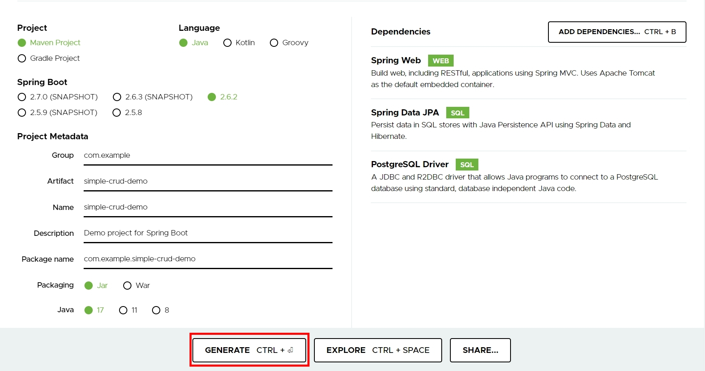
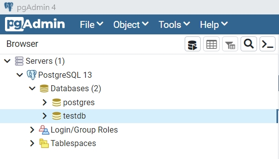
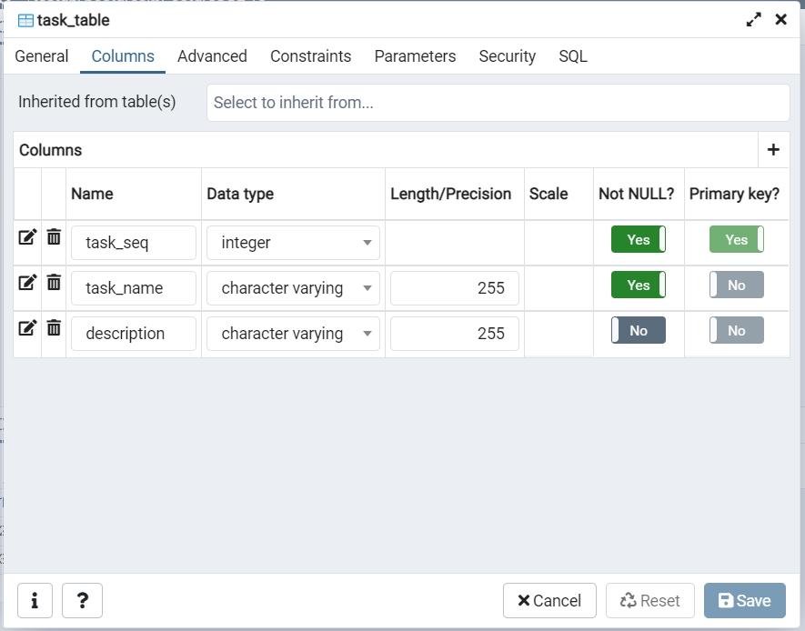
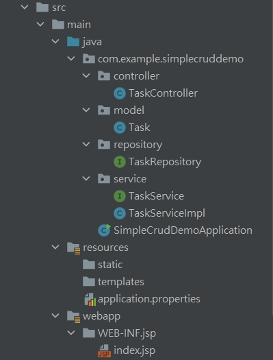
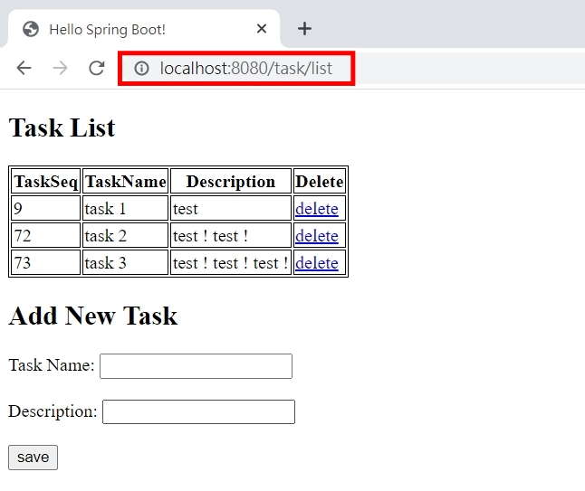

# Spring Boot and JPA using PostgreSQL

## 前置準備
- 安裝 PostgreSQL 與 pgAdmin4 [參考連結](https://www.youtube.com/watch?v=YysG13sFGok)
- 安裝 IntelliJ [參考連結](https://www.youtube.com/watch?v=EMLTOMdIz4w)

## 建立 Spring boot 專案
### Qucik Start - [Spring Initializr](https://start.spring.io/)


### PostgreSQL 資料庫
> Database
> 

> Table
>


### 參考專案結構


## 開始
### Step 0. 連接資料庫設定
`./resources/application.properties`
```properties
spring.datasource.url=jdbc:postgresql://localhost:5432/testdb
spring.datasource.driverClassName=org.postgresql.Driver
spring.datasource.username=postgres
spring.datasource.password=password
spring.jpa.database-platform=org.hibernate.dialect.PostgreSQL95Dialect
```
### Step 1. 建立 Model
`/model/Task`
```java
@Entity
@Table(name = "task_table")
public class Task {
    @Id
    @GeneratedValue(strategy = GenerationType.IDENTITY)
    Integer taskSeq;
    
    @Column(name = "task_name")
    String taskName;
    
    @Column(name = "description")
    String description;
}
```
`右鍵 > Generate > Getter and Setter()`<br>

### Step 2. 建立 Repository
`/repository/TaskRepository`
```java
public interface TaskRepository extends JpaRepository<Task, Integer> {

}
```
### Step 3. 建立 Service
`/service/TaskService`
```java
public interface TaskService {
    Task addTask(Task task);
    List<Task> getTasks();
    void removeTask(int taskSeq);
}
```
`/service/TaskServiceImpl`
```java
@Service("taskService")
public class TaskServiceImpl implements TaskService{
    @Autowired
    private TaskRepository taskRepository;

    @Override
    public Task addTask(Task task) {
        return taskRepository.save(task);
    }

    @Override
    public List<Task> getTasks() {
        return taskRepository.findAll(Sort.by(Sort.Direction.ASC, "taskSeq"));
    }

    @Override
    public void removeTask(int taskSeq) {
        taskRepository.deleteById(taskSeq);
    }
}
```
### Step 4. 建立 Controller
`/controller/TaskController`
```java
@Controller
@RequestMapping("/task")
public class TaskController {
    @Autowired
    private TaskService taskService;

    @GetMapping("/list")
    public String listTasks(Model model) {
        model.addAttribute("taskList", this.taskService.getTasks());
        return "index";
    }

    @RequestMapping(value = "/add", method = RequestMethod.POST)
    public String addTask(@ModelAttribute("task") Task task) {
        this.taskService.addTask(task);
        return "redirect:/task/list";
    }

    @RequestMapping("/remove/{id}")
    public String removeTask(@PathVariable("id") int id) {
        this.taskService.removeTask(id);
        return "redirect:/task/list";
    }
}
```
### Step 5. 建立 View
`../webapp/WEB-ING/jsp/index.jsp`
```html
<%@ page language="java" contentType="text/html; charset=UTF-8" pageEncoding="UTF-8"%>
<%@ taglib prefix="c" uri="http://java.sun.com/jsp/jstl/core" %>
<%@ taglib prefix="form" uri="http://www.springframework.org/tags/form" %>

<!DOCTYPE html>
<html>
<head>
<meta http-equiv="Content-Type" content="text/html; charset=UTF-8">
<title>Hello Spring Boot!</title>
<style>
table, th, td {
  border: 1px solid black;
}
</style>
</head>
<body>
    <h2>Task List</h2>
    <table>
        <thead>
            <tr>
                <th>TaskSeq</th>
                <th>TaskName</th>
                <th>Description</th>
                <th>Delete</th>
            </tr>
        </thead>
        <tbody>
            <c:forEach items="${taskList}" var="task">
                <tr>
                    <td>${task.taskSeq}</td>
                    <td>${task.taskName}</td>
                    <td>${task.description}</td>
                    <td>
                        <a href="remove/${task.taskSeq}">delete</a>
                    </td>
                </tr>
            </c:forEach>
        </tbody>
    </table>
    <h2>Add New Task</h2>
    <form:form action="add" method="POST">
        Task Name: <input type="text" name="taskName"/><br><br>
        Description: <input type="text" name="description"/><br><br>
        <input type="submit" value="save"/>
    </form:form>
</body>
</html>
```
## 修改 Spring Boot 以 JSP 方式顯示
> 預設是沒有支援以 JSP 來作為 view 的顯示
### Step 1. 
`./resources/application.properties`
```properties
spring.mvc.view.prefix = /WEB-INF/jsp/
spring.mvc.view.suffix = .jsp
```
### Step 2. 增加依賴項
`pom.xml`
```
<dependencies>
    ...
    <dependency>
        <groupId>org.apache.tomcat.embed</groupId>
        <artifactId>tomcat-embed-jasper</artifactId>
        <version>9.0.44</version>
    </dependency>

    <dependency>
        <groupId>org.springframework.boot</groupId>
        <artifactId>spring-boot-starter-tomcat</artifactId>
        <version>2.4.4</version>
    </dependency>

    <dependency>
        <groupId>javax.servlet</groupId>
        <artifactId>javax.servlet-api</artifactId>
        </dependency>
    <dependency>
        <groupId>javax.servlet</groupId>
        <artifactId>jstl</artifactId>
        <version>1.2</version>
    </dependency>
</dependencies>

<build>
    ...
    <resources>
        <resource>
            <directory>src/main/webapp</directory>
        </resource>

        <resource>
            <directory>src/main/resources</directory>
        </resource>
    </resources>
</build>
```
## 完成
> 執行專案，URL : `http://localhost:8080/task/list`
>



